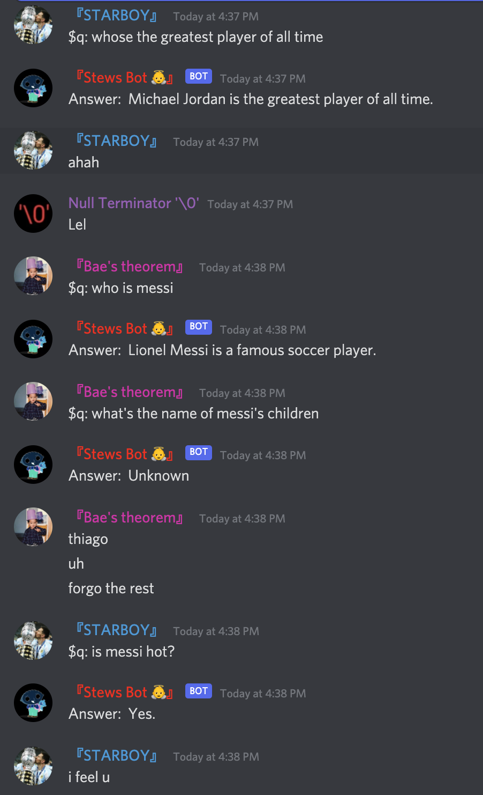

# Stews Bot

## Description
Stews Bot is a Discord Bot that responds to commands, certain messages with trigger words, and uses various API's to respond with.

## Commands

### $hello
Sends a hello message to the user

### $inspire
Inspirational quotes recieved from the https://zenquotes.io/ web API

### $memes
Memes receieved from reddit API (this is in NO way, shape or form of an application made by reddit. Simply an application using reddit posts data) from the following subreddits:
- r/dankmemes
- r/Memes_Of_The_Dank
- r/memes

### $ml SOME_MSG_HERE
Uses tensorflow machine learning to build models, train data, and give user a response accordingly (natural language processing)

### $q: SOME_QUESTION_HERE
uses the openai API to request a response using a prompt given by the user and sends that message \
back to the server channel which the query was made (by the user)

### $help
Displays a list of commands the bot is capable of reading

# Other
- Reacts to custom emojis with the emojis used to the message (works on main server only)
- when a sad word is detected, a positive message will appear
- pls shirt command says ilya shirt coming soon)
- mentioning @Stews Bot will give a message
- when a user joins the server, Stews will give a welcoming message

# TO-DO 
- Use db and store information
- react to message of sad words (sadge, itsokitsok, pensive) <- randomly (not always)
- make mlchatbot with user personal playground (using if statements to check user and global var for currently_in_ml_playground = False and users_playground = None) (https://www.youtube.com/watch?v=0fWdU8JCT6Y, timestamp: 8:00 explains a solution)
- learn how to run bot locally to test out ml stuff

- to update chatbotmodel.h5, need to run training.py on a local maching (push updated to repo, pull updated in repl.it)
